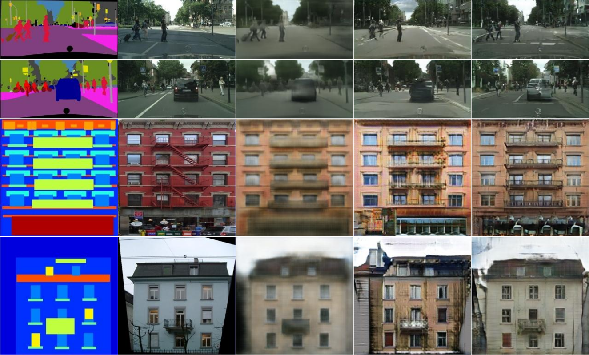

# Our take on Image-to-Image Translation with Conditional Adversarial Networks

In 2016, [Phillip Isola](http://web.mit.edu/phillipi/), et al. published their paper [Image-to-Image Translation with Conditional Adversarial Networks](https://arxiv.org/abs/1611.07004). The paper describes the inner workings of conditional Generative Adversarial Network (cGAN) -that goes by the name of [Pix2Pix](https://phillipi.github.io/pix2pix/)- designed for general purpose image-to-image translation.

As part of TU Delft's **CS4240 Deep Learning** course, we --Art van Liere, Pavel Suma, and Sigurd Totland-- to give reproducing the results of said paper a try. That is, we tried to develop an implementation of the cGAN, from scratch, that tries to mimic the results presented in the paper, _using only the paper_.

How does Pix2Pix work?
--

The Pix2Pix model is a cGAN; but what is a cGAN? First off, the cGAN is a type of generative adversarial network. This type of architecture is comprised of two models that work against each other:
 
 1. The generator model generating new synthetic images, and 
 2. The discriminator network that tries to distinguish between real and fake images (from the dataset and from generated by the generator model, respectively).
 
The two models work against in each other in the way that the generator tries to generate images that look real enough to fool the discriminator network, while the discriminator acts as a loss function, where the generated image is not compared to the ground truth, but to an ever-improving evaluator. As such, the two models are trained simultaneously in an adversarial process where, as the networks are trained, generated images get harder to tell apart from fake.

The cGAN is an extension of the regular GAN in that it takes a condition, or input image, from which it generates the output images. Thereby, the network can be steered towards the generation of a certain type of image beyond what it's trained on.

What can Pix2Pix do?
--

Pix2Pix has several 'configurations' it can be trained to work on. The configuration we focus on is one where the input image is a semantically segmented image and the output image is generated such that semantically segmented image would be equivalent to the input image.

The image below shows Pix2Pix in action: the first column is the input image; the second column is the ground truth, and the last three columns are generated by Pix2Pix, but trained on a different loss function --L1, cGan, L1 + cGan, respectively.

Our implementation
--

