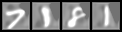

# UNet autodecoder identity function

This is a UNet implementation used as an autodecoder to learn an identity function.
Very useful indeed.

Inputs vs outputs of 1st vs 10th epoch:

  

  

Original paper by Olaf Ronneberger, Philipp Fischer, Thomas Brox: [https://arxiv.org/abs/1505.04597](https://arxiv.org/abs/1505.04597)

