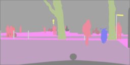
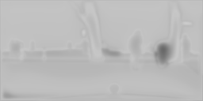
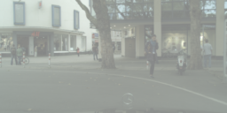

# UNet experimentation

## Cityscapes labels to images
In `mask_to_city.ipynb`, the UNet is trained to turn colored segmentation masks from the Cityscapes dataset into real life images.
To run this, go to [the cityscapes website](https://www.cityscapes-dataset.com/downloads/) and download both `gtFine_trainvaltest.zip` (241MB) and `leftImg8bit_trainvaltest.zip` (11GB).
Unzip these and place them in `data/cityscapes` so that the directory looks like so:
```
data
└── cityscapes
    ├── gtFine
    │   ├── test
    │   ├── train
    │   └── val
    └── leftImg8bit
        ├── test
        ├── train
        └── val
```
Example input mask, output image and ground truth image:

   

## Autoencoder for MNIST
In `auto_unet.ipynb` the UNet is trained as an autoencoder learning to map digits to digits.
The notebook downloads the MNIST dataset for you, so you can run it as is.

Inputs vs outputs of 1st vs 10th epoch:

  

  

## Paper
Original paper by Olaf Ronneberger, Philipp Fischer, Thomas Brox: [https://arxiv.org/abs/1505.04597](https://arxiv.org/abs/1505.04597)


